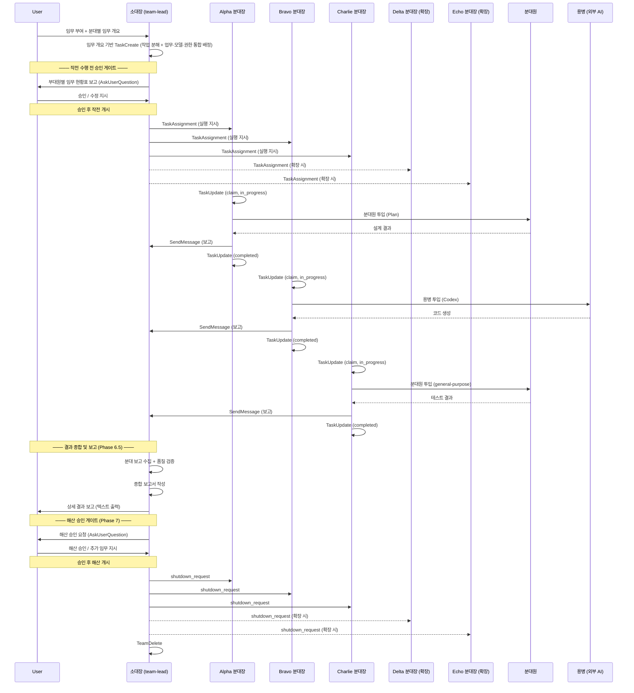

# Platoon Formation (소대 편제 방식 팀구성)

현재 프로젝트 디렉토리 이름을 기반으로 Agent Teams 소대(45명 이상)를 편성하고, 용병(CLI/API/MCP)을 전략적으로 활용하여 임무를 수행한다.

---

## Phase 1. 팀 생성 및 소대 편성

### Step 1: 팀 생성
- 현재 작업 디렉토리의 폴더명을 추출하여 `{폴더명}-platoon` 이름으로 TeamCreate 실행
- 예: 작업 디렉토리가 `mychatbot-world`이면 → `mychatbot-platoon`

### Step 1-1: HQ 편성 (본부)

| 직책 | 역할 | 모델 | 비고 |
|------|------|------|------|
| **소대장** (team-lead) | Orchestrator, 전략적 의사결정 | opus | 직접 코딩 최소화 |
| **연락병** (Chatbot) | 지휘관(User) ↔ 소대장 간 연락 | - | 채팅 인터페이스 |

### Step 2: 분대장 스폰 (NATO 호출부호)

**기본 3개 분대(A형)**로 먼저 스폰한다. 역할은 임무 배정 시 동적으로 결정한다.
분대 수 최종 결정은 Phase 1.5에서 지휘관이 임무 부여 시 함께 결정한다.

#### 편성 타입

| 타입 | 분대 수 | 호출부호 | 적용 기준 |
|------|--------|---------|----------|
| **A형 (기본)** | 3개 | Alpha, Bravo, Charlie | 일반적인 임무, 소규모~중규모 프로젝트 |
| **B형 (확장)** | 5개 | Alpha ~ Echo | 대규모 프로젝트, 복합 도메인 임무 |
| **C형 (지정)** | 6개 이상 | Alpha ~ (NATO 호출부호 순서) | 초대규모 임무, 특수 요구사항 |

> **참고**: Claude Code Agent Teams 공식 문서에 teammate 수의 하드 리밋은 없으나,
> 공식 권장은 3~5개이다. 6개 이상(C형)은 API Rate Limit, 토큰 비용 증가, 조율 오버헤드를
> 고려해야 한다.

#### NATO 호출부호 순서 (분대 번호)

| 순번 | 호출부호 | 순번 | 호출부호 | 순번 | 호출부호 |
|------|---------|------|---------|------|---------|
| 1 | **Alpha** | 5 | **Echo** | 9 | **India** |
| 2 | **Bravo** | 6 | **Foxtrot** | 10 | **Juliet** |
| 3 | **Charlie** | 7 | **Golf** | 11 | **Kilo** |
| 4 | **Delta** | 8 | **Hotel** | 12 | **Lima** |

#### 분대장 편성표

| 호출부호 | 직책 | 기본 역할 | 모델 | 편성 타입 |
|---------|------|----------|------|----------|
| **Alpha** | 1분대장 | 역할 미정 (임무 시 배정) | sonnet (기본) / 소대장 선정 | A·B·C형 |
| **Bravo** | 2분대장 | 역할 미정 (임무 시 배정) | sonnet (기본) / 소대장 선정 | A·B·C형 |
| **Charlie** | 3분대장 | 역할 미정 (임무 시 배정) | sonnet (기본) / 소대장 선정 | A·B·C형 |
| **Delta** | 4분대장 | 역할 미정 (임무 시 배정) | sonnet (기본) / 소대장 선정 | B·C형 |
| **Echo** | 5분대장 | 역할 미정 (임무 시 배정) | sonnet (기본) / 소대장 선정 | B·C형 |
| **Foxtrot~** | 6분대장~ | 역할 미정 (임무 시 배정) | sonnet (기본) / 소대장 선정 | C형 (지휘관 지정 시) |

#### 스폰 실행 절차

```
┌─────────────────────────────────────────────────────────────────┐
│  Step 2-0. 사전 준비 (스폰 전)                                    │
│    ① 외부 파일이 필요한 임무인가?                                   │
│       → Yes: 지휘관에게 파일 접근 허용 요청 (1회)                    │
│              소대장이 Read 도구로 파일 내용을 미리 읽어둠              │
│       → No: 생략                                                │
│    ② TeamCreate 실행 ({폴더명}-platoon)                           │
│                                                                 │
│  Step 2-1. 기본 분대장 3개 동시 스폰 (A형 기본 편성)                  │
│    ① Alpha, Bravo, Charlie를 하나의 메시지에서 병렬 스폰              │
│       - Agent 도구 3개를 동시에 호출 (순차 호출 금지)                  │
│       - 모델: sonnet (기본값, Phase 1.5 임무 부여 시 변경 가능)        │
│       - mode: bypassPermissions (기본값, Phase 1.5에서 조정 가능)    │
│       - run_in_background: true                                  │
│       - team_name: {폴더명}-platoon                               │
│       - subagent_type: general-purpose                           │
│       - prompt: 스폰 프롬프트 템플릿 (아래 참조)                     │
│    ② 3개 idle 상태 진입 확인                                       │
│       - idle_notification 3건 수신 대기                            │
│       - 1개라도 미수신 시 재스폰 검토                              │
│                                                                 │
│  Step 2-2. 기본 편성 완료 → Phase 1.5로 진행                        │
│    ① 3개 전원 idle 확인                                            │
│    ② Phase 1.5에서 지휘관이 분대 수 최종 결정                        │
│       → A형(3개) 유지: 바로 임무 부여                               │
│       → B형(5개): Delta, Echo 추가 스폰                            │
│       → C형(6+): 지휘관 지정 수만큼 추가 스폰                       │
└─────────────────────────────────────────────────────────────────┘
```

**필수 체크리스트:**
- [ ] TeamCreate 완료
- [ ] Alpha 스폰 + idle 확인
- [ ] Bravo 스폰 + idle 확인
- [ ] Charlie 스폰 + idle 확인
- [ ] Phase 1.5 임무 부여 + 분대 수 결정 대기

---

## Phase 1.5. 임무 부여 + 분대 수 결정 (지휘관 개입 ①)

기본 3개 분대(A형) 스폰 완료 후, 소대장이 지휘관에게 **임무 부여 + 분대 수 결정**을 함께 질문한다.

**소대장 → 지휘관 질문 (AskUserQuestion 사용):**
```
소대 기본 편성(3개 분대: Alpha, Bravo, Charlie)이 완료되었습니다.

임무를 부여해 주십시오. 아울러 분대 수를 결정해 주십시오.

  • A형 (기본 3개 분대) — 현재 편성 유지
  • B형 (확장 5개 분대) — Delta, Echo 추가 편성
  • C형 (6개 이상) — 원하시는 분대 수를 지정해 주십시오
```

**절차:**
1. 소대장이 AskUserQuestion으로 지휘관에게 임무 + 분대 수 질문
2. 지휘관이 전체 임무 + 분대별 임무 개요 + 분대 수(A/B/C형) 결정
3. 분대 수 결정에 따른 처리:
   - **A형 유지**: 추가 스폰 없이 다음 단계로
   - **B형 확장**: Delta, Echo 2개 추가 스폰 → idle 확인
   - **C형 지정**: 지휘관이 지정한 수만큼 추가 분대장 스폰 → idle 확인
4. Phase 1.7로 진행

**지휘관 상호작용 제한 원칙 (최우선):**

전체 작전에서 지휘관 상호작용은 **최대 3회**다. 그 외에는 지휘관을 건드리지 않는다.

| 횟수 | 시점 | 용도 |
|------|------|------|
| **개입 ①** | Phase 1.5 (S15) | 임무 부여 + 분대 수 결정 |
| **개입 ②** | Phase 5.5 (S60) | 작전 개시 승인 |
| **개입 ③** | Phase 7 (S80) | 해산 승인 |

- 위 3회 외에 지휘관 상호작용 금지
- 임무 중간에 지휘관에게 보고/질문/확인 금지
- 분대장 블로커는 소대장이 자율 판단하여 해결
- 분대장 간 의견 충돌도 소대장이 자율 중재
- 작전 수행 중 파일 접근/도구 사용으로 권한 팝업을 유발하지 않는다

---

## Phase 1.7. 소대장 작업 분해 및 업무·모델·권한 통합 배정

임무를 수령한 소대장이 세부 작업을 분해(TaskCreate)하고, 각 분대장에게 **구체적 업무 + AI 모델 등급 + 도구 사용 권한을 한 번에 통합 지정**한다.

**절차:**
1. **작업 분해**: 임무 개요를 기반으로 세부 작업 분해
2. **통합 배정**: 각 분대장에게 SendMessage로 아래를 일괄 지정:
   ```
   Alpha 분대장에게:
     - 업무: {구체적 업무 내용}
     - 사용 모델: {opus / sonnet / haiku — 임무 성격·난이도·비용 종합 고려하여 소대장이 선정}
     - 도구 권한: {Read/Write/Edit/Bash/Agent 등 — 업무에 맞게 소대장이 선별 부여}
   ```
   - 모델 등급: 소대장이 **임무의 성격·난이도·비용 최적화**를 종합적으로 고려하여 선정
     - 고수준 추론/다중 도메인/높은 자율성 → 고급 모델 (품질 우선)
     - 표준적 추론/단일 도메인 → 중급 모델 (비용 대비 성능 균형)
     - 정형적 처리/단순 반복 → 경량 모델 (비용 절감)
     - 하향 우선 원칙: 동일 품질 가능 시 하위 등급 우선 선정
   - 도구 권한: 소대장이 임무 성격에 기반하여 선별적 부여 (최소 권한 원칙)
     - 조사·분석 임무 → 읽기 권한만
     - 구현·수정 임무 → 읽기 + 쓰기 + 실행
     - 팀 관리 임무 → 읽기 + 쓰기 + 실행 + 에이전트 생성
     - 기본값: bypassPermissions (전 권한) — 소대장 판단에 따라 제한 가능
   - **업무·모델·권한은 한 번에 통합 지정** — 별도 단계로 분리하지 않음
3. 배정안을 기반으로 Phase 2(용병 투입 전략)와 Phase 3~4(스킬 장착) 진행

**비용 최적화 편제표:**

| 역할 | 수량 | 모델 | 근거 |
|------|------|------|------|
| 소대장 (team-lead) | 1 | opus | 오케스트레이션, 전략적 의사결정 |
| 연락병 (Chatbot) | 1 | - | 지휘관(User) ↔ 소대장 연락 |
| 분대장 (Teammate) | N (≥3) | sonnet (기본) / 소대장 선정 | 기본 sonnet, 임무 성격·난이도·비용 고려하여 소대장이 변경 |
| 정규병 (SubAgent) | N×12 | haiku / sonnet | 12개/분대, 분대장이 작업 복잡도 판단하여 선정 |
| 예비병 (SubAgent) | N×3 | haiku / sonnet | 3개/분대, 보조 인력 (정원 외) |
| 용병 (외부 AI) | 4 | 타사 모델 | 공유 풀, 특화 작업 |
| **합계** | **45명~** | | 예비병 별도 |

**편제 공식:** HQ(2) + N Squads × 13(Leader+12정규) + 4 Mercenaries(Shared) (N≥3) + 예비병 N×3 별도

**단일 책임 원칙:** 각 분대장은 지휘관이 부여한 임무 개요에 따라 전문 분야에 집중한다.

| 분대 | 기본 역할 (지휘관 미지정 시) | 주요 작업 예시 |
|------|---------------------------|---------------|
| Alpha | 설계/분석 | 아키텍처 설계, 요구사항 분석, 리서치 |
| Bravo | 개발/구현 | 코드 작성, API 구현, 빌드/배포 |
| Charlie | 문서/QA | 테스트 작성, 문서화, 코드 리뷰 |
| Delta | 보안/인프라 (확장 시) | 보안 감사, CI/CD, 인프라 구축 |
| Echo | 성능/최적화 (확장 시) | 성능 측정, 최적화, 모니터링 |

지휘관이 분대별 임무 개요를 명시하면 해당 지시를 우선 따른다.

### Step 2-1: 정규병 12개 + 예비병 3개 (각 분대 공통)

각 분대에 정규병 12개 + 예비병 3개를 배치한다. 분대장이 Task 도구로 투입.

**정규병 12개:**

| # | Sub-Agent | 역할 | 기본 모델 |
|---|-----------|------|----------|
| 1 | **frontend-developer** | 프론트엔드 UI 개발 | sonnet |
| 2 | **ux-ui-designer** | UX/UI 디자인 | sonnet |
| 3 | **api-developer** | API 엔드포인트 설계 / 구현 | sonnet |
| 4 | **backend-developer** | 백엔드 API / 서버 로직 | sonnet |
| 5 | **database-developer** | DB 스키마 / 쿼리 최적화 | sonnet |
| 6 | **code-reviewer** | 코드 리뷰 / 품질 검증 | sonnet |
| 7 | **test-runner** | 테스트 실행 / 자동화 | haiku |
| 8 | **security-specialist** | 보안 점검 / 취약점 분석 | sonnet |
| 9 | **devops** | 배포 / 환경 / CI-CD / 인프라 | sonnet |
| 10 | **debugger** | 디버깅 / 문제 해결 | sonnet |
| 11 | **doc-writer** | 문서 작성 / README / 가이드 | haiku |
| 12 | **content-copy** | 콘텐츠 기획 / 카피라이팅 | haiku |

**예비병 3개 (정원 외, 필요 시 투입):**

| # | Sub-Agent | 역할 | 기본 모델 |
|---|-----------|------|----------|
| 1 | **qa-specialist** | QA 전문 검증 / 품질 보증 | sonnet |
| 2 | **refactoring-specialist** | 코드 리팩토링 / 구조 개선 | sonnet |
| 3 | **performance-optimizer** | 성능 최적화 / 병목 분석 | sonnet |

**소대장의 모델 선정 원칙:** 소대장이 Phase 1.7(작업 분해 및 통합 배정) 단계에서 각 분대장에게 구체적 업무를 배정할 때, **임무의 성격·난이도·비용 최적화를 종합적으로 고려하여** AI 모델 등급을 선정한다. 고수준 추론이 필요한 업무에는 고급 모델(opus)을, 정형적 업무에는 경량 모델(haiku)을 배치하여 비용 대비 성능을 극대화한다. 동일 품질 달성이 가능한 경우 하위 등급 모델을 우선 선정한다(하향 우선 원칙).

**분대장의 분대원 투입 원칙:** 분대장이 세부 작업을 분해한 후, 다음 기준에 따라 분대원을 투입한다.
- **에이전트 탐색 우선순위** (2단계 Fallback):
  1. **1순위 — 사용자 커스텀 에이전트**: 표준 분대원 11종(위 표) 및 `~/.claude/agents/`에 사용자가 사전 등록한 커스텀 에이전트를 포함하여, 작업 성격에 적합한 분대원을 우선 선정한다 (예: UI 구현→frontend-developer, 보안 점검→security-specialist)
  2. **2순위 — 외부 탐색**: 등록된 에이전트 중 적합한 것이 없는 경우, Anthropic 공식 에이전트, GitHub 커뮤니티 등 외부 소스에서 적합한 에이전트를 탐색하여 투입한다
- **모델 등급 선정**: 추론이 필요한 작업(코드 구현, 분석)→중급 모델(sonnet), 정형적 작업(단순 반복, 템플릿)→경량 모델(haiku)
- **결과 수집**: 분대원 작업 결과를 수집·검증하여 소대장에게 보고. 실패 시 재시도(1회)→대안 투입→상위 보고의 3단계 대응

**스폰 프롬프트 템플릿:**
```markdown
너는 "{호출부호}", {프로젝트명}-platoon 소대의 분대장이다.

## 소속 및 역할
- 소대: {프로젝트명}-platoon
- 직책: {분대명} 분대장
- 기본 역할: {역할 설명}
- 임무 배정 방식: 지휘관(User)이 분대별 임무 개요를 부여 → 소대장이 세부 작업 분해 후 지시

## 작전 수행 절차
1. **임무 수령**: 소대장으로부터 TaskAssignment 메시지 수신 (지휘관이 지정한 분대별 임무 개요 기반)
2. **승인 대기**: 소대장이 지휘관에게 전체 임무 현황을 보고하고 승인받을 때까지 대기
3. **작업 확인**: 승인 후, TaskList에서 할당된 작업 확인
4. **작업 Claim**: TaskUpdate로 owner를 자신으로 설정, status를 in_progress로 변경
5. **병력 동원**:
   - 분대원: Task 도구로 haiku/sonnet 모델 투입 (11개 표준 편제)
   - 용병(외부 AI CLI): Bash에서 headless 모드로 호출 (4개 공유 풀)
6. **진행 보고**: 작업 중 중요 변경점이나 블로커 발생 시 SendMessage로 소대장에게 보고
7. **임무 완료**: TaskUpdate로 status를 completed로 변경 후 결과 보고

## 병력 활용 원칙
- **분대원 우선**: 일반적인 작업은 분대원(haiku/sonnet)으로 처리
- **용병 선택적 투입**: 특화된 작업(대용량 컨텍스트, 빠른 실행)에만 사용
- **용병은 공유 자산**: 소대장·분대장 누구나 호출 가능
- **병렬 투입**: 독립적인 작업은 동시에 여러 병력 투입

## 권한 (소대장이 임무 성격에 기반하여 선별적 부여)
- 소대장이 임무 성격을 판단하여 최소 권한 원칙에 따라 도구 사용 권한을 부여한다
  - 조사·분석 임무 → 읽기(Read) 권한만
  - 구현·수정 임무 → 읽기(Read) + 쓰기(Write/Edit) + 실행(Bash)
  - 팀 관리 임무 → 읽기 + 쓰기 + 실행 + 에이전트 생성(Agent)
- 기본값: bypassPermissions 모드 (전 권한 부여) — 소대장 판단에 따라 제한 가능
- 분대원에게도 동일 원칙 적용 — 분대장이 분대원에게 필요한 권한을 위임

## 제약사항
- 직접 코딩 최소화 (병력을 동원하라)
- 완료 보고 없이 대기 상태로 두지 않기
- 작업 실패 시 원인 분석 후 재투입 또는 소대장 보고
- **지휘관(User)에게 직접 질문/확인/보고 금지** — 모든 보고는 소대장에게만

## 대기 상태
현재 역할 미정. 소대장의 임무 배정을 대기하라.
```

---

## Phase 2. 용병 투입 전략 (외부 AI — 공유 풀)

용병 4개는 **공유 자산**. 소대장·분대장 누구나 필요 시 호출한다.

### 용병 풀 (Mercenary Pool — Shared)

| # | 용병명 | 제공 | 호출 방법 | 특장점 | 투입 시점 |
|---|-------|------|----------|--------|----------|
| 1 | **Codex** | OpenAI | `codex -p "프롬프트" --full-auto -C "디렉토리"` | 코드 자동 생성/실행 | 새 프로젝트 스캐폴딩, 보일러플레이트 |
| 2 | **Gemini** | Google | `gemini -p "프롬프트" --context-window=2M` | 대용량 컨텍스트(200만 토큰) | 전체 코드베이스 분석, 대규모 리팩토링 |
| 3 | **Grok** | xAI | `grok -p "프롬프트" --fast` | 빠른 응답, 실시간 검색 | 빠른 프로토타이핑, 트렌드 조사 |
| 4 | **Perplexity** | Perplexity | MCP (`perplexity_ask`) | 실시간 웹 검색, 리서치 | 최신 정보, API 사양, 베스트 프랙티스 |

### 호출 방법

**CLI 용병 (Codex, Gemini, Grok):**
```bash
# Bash에서 headless 모드로 호출, 결과를 파일로 저장
{CLI 명령어} > /tmp/{용병명}_output.txt 2>&1
```

**리서치 용병 (Perplexity):**
```bash
# MCP 서버로 연결 (사전 설정 완료)
perplexity_ask 도구 사용
```

### 용병 투입 판단 기준

| 용병 | 투입 시점 |
|------|----------|
| **Codex** | 빈 디렉토리에 프로젝트 구조를 빠르게 생성할 때 |
| **Gemini** | 수백 개 파일을 동시에 분석해야 할 때 (Claude 컨텍스트 초과 시) |
| **Grok** | 단순 반복 작업을 빠르게 처리하거나 실시간 트렌드 조사 |
| **Perplexity** | 외부 문서, 최신 정보, Claude 지식 컷오프 이후 정보 필요 시 |

### 핵심: 공유 자산

```
┌────────────────────────────────────────────────────────────┐
│  용병은 특정 분대에 소속되지 않는다!                           │
│  소대장, Alpha, Bravo, Charlie 누구나 호출 가능               │
│  임무에 맞는 용병을 골라 투입하면 된다                         │
└────────────────────────────────────────────────────────────┘
```

---

## Phase 3. 스킬 연동 (다른 스킬과의 시너지)

### /deploy-subagent 스킬과 연동

분대장이 분대원을 투입할 때 `/deploy-subagent` 스킬의 2단계 Fallback 전략을 활용한다.

**연동 방식:**
1. 분대장이 임무를 받으면 `/deploy-subagent`의 탐색 로직 적용
   - 1순위: 사용자 커스텀 에이전트 (표준 11종 + `~/.claude/agents/` + 내장 subagent_type)
   - 2순위: 외부 탐색 또는 신규 생성
2. 적합한 에이전트를 찾으면 Task 도구로 투입
3. 에이전트가 없으면 `/deploy-subagent`의 커스텀 에이전트 생성 템플릿 사용

**예시:**
```
Alpha 분대장이 "API 설계" 임무를 받음
→ `~/.claude/agents/api-design-agent.md` 확인
→ 없으면 `Plan` 타입 subagent 사용
→ 결과를 파일로 저장 후 소대장에게 보고
```

### /create-image 스킬과 연동

이미지 생성이 필요한 임무는 `/create-image` 스킬의 Decision Tree를 따른다.

**연동 방식:**
1. 분대장이 "다이어그램 생성" 임무를 받음
2. `/create-image`의 Phase 1 Decision Tree로 방식 결정
   - 시퀀스 다이어그램 → Mermaid
   - 대시보드 → HTML→PNG
   - 조직도 → SVG
3. `/create-image`의 Phase 2 템플릿을 사용하여 분대원 투입
4. 생성된 이미지 경로를 소대장에게 보고

**예시:**
```
Bravo 분대장이 "시스템 아키텍처 다이어그램" 임무를 받음
→ /create-image Decision Tree 확인
→ 조직도로 판단 → SVG 방식 선택
→ haiku 모델로 분대원 투입
→ C:/Users/home/Desktop/architecture.svg 생성
→ 소대장에게 파일 경로 보고
```

---

## Phase 4. 스킬 장착 체계 (Skills System)

분대원 에이전트가 배정받은 임무를 분석하여 필요한 **스킬(슬래시 커맨드)**을 자율적으로 선택·장착한다. 분대장도 직접 스킬을 사용할 수 있다.

### 스킬 = 슬래시 커맨드

스킬은 `~/.claude/commands/` (전역) 또는 `.claude/commands/` (프로젝트)에 저장된 재사용 가능한 커맨드다.

**특징**:
- **호출 방법**: `Skill` 도구로 실행 (예: `Skill({skill: "deploy-subagent"})`)
- **공용 가능**: 소대장, 분대장, 서브에이전트 누구나 사용 가능
- **전문성 부여**: 복잡한 전략을 캡슐화하여 즉시 활용

### 현재 장착 스킬 (Available Skills)

| # | 스킬 | 기능 그룹 | 용도 | 소대장 | 분대장 | 서브에이전트 |
|---|------|----------|------|--------|--------|-------------|
| 1 | `/sal-grid-dev` | 프로젝트 관리 | SAL Grid Dev Suite (9-PART) | O | O | O |
| 2 | `/deploy-subagent` | 팀 편성 | 최정예 서브에이전트 편성 및 투입 | O | O | X (중첩 금지) |
| 3 | `/deploy-skill` | 팀 편성 | 최강 스킬 조합 편성 | O | O | O |
| 4 | `/find-skills` | 팀 편성 | 스킬 검색 + 설치 (skills.sh) | O | O | O |
| 5 | `/api-builder` | 개발 & 인프라 | REST API 구축 / CRUD / Zod 검증 | O | O | O |
| 6 | `/ui-ux-builder` | 개발 & 인프라 | UX 설계 + UI 구현 | O | O | O |
| 7 | `/db-schema` | 개발 & 인프라 | DB 스키마 설계 / RLS / 마이그레이션 | O | O | O |
| 8 | `/cicd-setup` | 개발 & 인프라 | GitHub Actions CI/CD 파이프라인 | O | O | O |
| 9 | `/slideshow-web` | 콘텐츠 & 생성 | PPT 슬라이드쇼 웹페이지 생성 | O | O | O |
| 10 | `/youtube-generate` | 콘텐츠 & 생성 | YouTube 영상 올인원 제작 | O | O | O |
| 11 | `/create-image` | 콘텐츠 & 생성 | 이미지 생성 (SVG/HTML/Mermaid/Pillow) | O | O | O |
| 12 | `/doc-generator` | 콘텐츠 & 생성 | 문서 생성 (PDF/DOCX/PPTX/XLSX/HWP) | O | O | O |
| 13 | `/review-evaluate` | 품질 & 보안 | 검토 및 5기준 평가 (통제 프로세스) | O | O | O |
| 14 | `/security-audit` | 품질 & 보안 | OWASP Top 10 보안 감사 | O | O | O |
| 15 | `/troubleshoot` | 품질 & 보안 | 디버깅 / 문제해결 / RCA | O | O | O |
| 16 | `/e2e-test` | 품질 & 보안 | Playwright E2E 테스트 | O | O | O |
| 17 | `/api-test` | 품질 & 보안 | Jest/Supertest + 부하 테스트 | O | O | O |
| 18 | `/performance-check` | 품질 & 보안 | Lighthouse / Core Web Vitals 최적화 | O | O | O |
| 19 | `/cpc-setup` | CPC 인프라 | CPC 인프라 구축 (Supabase + Vercel) | O | X | X |
| 20 | `/cpc-add-project` | CPC 인프라 | 신규 프로젝트 CPC 등록 · 소대 생성 | O | X | X |
| 21 | `/cpc-engage` | CPC 인프라 | 매 세션 소대장 접속 · Agent Server 가동 | O | X | X |

**6개 기능 그룹:**
- **프로젝트 관리** (1): SAL Grid Dev
- **팀 편성** (3): deploy-subagent, deploy-skill, find-skills
- **개발 & 인프라** (4): api-builder, ui-ux-builder, db-schema, cicd-setup
- **콘텐츠 & 생성** (4): slideshow-web, youtube-generate, create-image, doc-generator
- **품질 & 보안** (6): review-evaluate, security-audit, troubleshoot, e2e-test, api-test, performance-check
- **CPC 인프라** (3): cpc-setup, cpc-add-project, cpc-engage

**총 21 Skills**

### 스킬 활용 방법

#### 분대장이 스킬 사용

분대장은 임무 수행 중 필요한 스킬을 직접 호출:

```javascript
// 의사 코드 (pseudo-code) — 실제로는 Skill 도구로 호출
Skill({
  skill: "deploy-subagent",
  args: "API 설계 전문 에이전트 투입"
})
```

#### 서브에이전트가 스킬 사용

분대장이 서브에이전트(분대원)를 투입할 때, 임무만 부여하고 스킬 선택은 분대원이 자율적으로 수행한다:

```javascript
Agent({
  description: "이미지 생성 작업",
  prompt: `
너는 디자인 전문 에이전트다.

임무: 시스템 아키텍처 다이어그램 생성
요구사항: 조직도 형태, SVG 포맷

임무를 분석하여 적절한 스킬을 자율적으로 선택·장착하라.
`,
  subagent_type: "general-purpose",
  model: "haiku"
})
```

### 스킬 자율 장착 원칙

분대원 에이전트가 임무를 분석하여 필요한 스킬을 **자율적으로 선택·장착**한다. 분대장이 일일이 지시하지 않는다.

**2단계 탐색 우선순위:**

| 우선순위 | 소스 | 위치 | 예시 |
|---------|------|------|------|
| **1순위** | 사용자 커스텀 스킬 | `~/.claude/commands/` (전역) · `.claude/commands/` (프로젝트) | deploy-subagent, create-image, my-deploy.md |
| **2순위** | 외부 탐색 | GitHub, npm 등 커뮤니티 | awesome-claude-skills |

**확보 전략**:
1. 사용자가 등록해 놓은 스킬에서 우선 선택
2. 적합한 스킬이 없으면 외부 커뮤니티에서 탐색

### 스킬 조합 전략 (Skill Combo)

여러 스킬을 조합하여 복합 임무 수행:

**예시: API 개발 + 문서화 + 이미지 생성**
```javascript
// 1. 서브에이전트 투입으로 API 개발
Skill({skill: "deploy-subagent", args: "API 구현"})

// 2. 문서 생성 (프로젝트 커스텀 스킬)
Skill({skill: "generate-api-docs"})

// 3. 아키텍처 다이어그램 생성
Skill({skill: "create-image", args: "API 아키텍처 다이어그램"})
```

### 스킬 개발 가이드 (신규 스킬 생성)

프로젝트 특화 스킬이 필요하면 `.claude/commands/`에 생성:

**템플릿** (`.claude/commands/my-skill.md`):
```markdown
# My Skill (스킬 이름)

## 목적
[이 스킬이 하는 일]

## 사용법
[호출 방법 및 인자]

## 실행 로직
[단계별 수행 절차]

## 예시
[실제 사용 예시 코드]
```

**생성 후**:
- Skill 도구로 즉시 호출 가능
- 분대장/서브에이전트 모두 사용 가능

---

## 통신 구조

소대 내 통신은 **수직 통신**(상하 계층)과 **수평 교신**(동급 간)으로 구분된다.

| 통신 유형 | 경로 | 방식 | 용도 |
|----------|------|------|------|
| **수직 통신** | 소대장 → 분대장 → 분대원 | SendMessage (하향), 결과 보고 (상향) | 임무 지시·결과 보고 |
| **수평 교신** | 분대장 ↔ 분대장 | SendMessage (분대장 간 직접) | 분대 간 협업·데이터 공유·충돌 조정 |
| **외부 호출** | 소대장·분대장 → 용병 풀 | Bash CLI / MCP (점선) | 특화 작업 위임 |

**수평 교신 원칙:**
- 분대장 간 직접 SendMessage로 교신 가능 (소대장 경유 불필요)
- 분대 간 작업 의존성이 있을 때 결과·데이터를 직접 공유
- 의견 충돌 시 소대장이 자율 중재

---

## Phase 5. 작전 대기 상태 보고

임무 부여·작업 분해·용병 전략·스킬 장착이 모두 완료된 후, 소대 현황과 임무 배정 현황을 표로 보고:

```
╔════════════════════════════════════════════════════════════╗
║      {프로젝트명}-platoon 작전 준비 완료 ({총원}개)           ║
╚════════════════════════════════════════════════════════════╝

[HQ] 소대장(Opus) + 연락병(Chatbot) = 2개

| 분대 | 분대장 | 배정 임무 | 분대원 | 상태 |
|------|--------|----------|--------|------|
| 1분대 | Alpha   | {배정 임무} | 11개 (분대원) | 대기 |
| 2분대 | Bravo   | {배정 임무} | 11개 (분대원) | 대기 |
| 3분대 | Charlie | {배정 임무} | 11개 (분대원) | 대기 |
| 4분대 | Delta   | {배정 임무} | 11개 (분대원) | 대기 |  ← 확장 시
| 5분대 | Echo    | {배정 임무} | 11개 (분대원) | 대기 |  ← 확장 시

[용병 풀] 공유 자산 — 소대장/분대장 누구나 호출 가능
- Codex (코드 생성)
- Gemini (대용량 분석)
- Grok (실시간 검색)
- Perplexity (리서치)

[스킬] 21 Skills / 6 기능 그룹

편제: HQ(2) + N × 13(Leader+12정규) + 4 Mercenaries = {총원}명 (N≥3) + 예비병 N×3 별도
작전 준비 완료. 지휘관님, 작전 개시를 승인해 주십시오.
```

---

## Phase 5.5. 작전 개시 승인 게이트 (지휘관 개입 ②)

Phase 5의 작전 대기 상태 보고를 확인한 지휘관이 **작전 개시를 승인**한다.
(임무 부여는 Phase 1.5에서, 작업 분해는 Phase 1.7에서 이미 완료)

**⚠️ AskUserQuestion 승인 요청은 전체 작전에서 딱 2회만 한다 (개입 ②, ③):**
1. **작전 개시 승인** (이 Phase / S60) — 개입 ②
2. **해산 승인** (Phase 7 / S80) — 개입 ③

**임무 수행 중간에 추가 승인을 요청하지 않는다.** 임무가 여러 단계(예: 검토→수정)로 구성되어도, 최초 작전 승인 1회로 전체 단계를 포괄한다. 소대장이 단계 간 전환을 자율적으로 판단하여 진행한다.

### 절차

1. **임무 현황 보고**: AskUserQuestion으로 부대원별 임무 배정 현황표를 지휘관에게 보고
2. **지휘관 판단**:
   - **승인** → 작전 수행 개시 (분대장들에게 실행 지시). 이후 단계 전환 시 추가 승인 불필요.
   - **수정 지시** → 소대장이 임무 재편성 후 다시 보고

### 보고 형식

```
╔════════════════════════════════════════════════════════════╗
║           작전 수행 전 임무 현황 보고                        ║
╚════════════════════════════════════════════════════════════╝

📋 임무: {임무명}

| 분대 | 분대장 | 배정 임무 | 세부 Task | 상태 |
|------|--------|----------|----------|------|
| 1분대 | Alpha   | {임무} | Task #1, #2 | 대기 |
| 2분대 | Bravo   | {임무} | Task #3, #4 | 대기 |
| 3분대 | Charlie | {임무} | Task #5, #6 | 대기 |
| 4분대 | Delta   | {임무} | Task #7, #8 | 대기 |  ← 확장 시
| 5분대 | Echo    | {임무} | Task #9, #10 | 대기 | ← 확장 시

지휘관님, 작전 수행을 승인해 주십시오.
- [승인] 작전 개시
- [수정] 임무 재편성
```

### 핵심 원칙

- **승인 없이 작전 수행 금지**: 소대장은 임무 현황 보고 후 지휘관 승인 전까지 분대장에게 실행 지시를 내리지 않는다
- **수정 반복 가능**: 지휘관이 수정을 지시하면 재편성 후 다시 보고하여 승인을 받는다
- **중간 승인 금지**: 작전 승인 후 임무 단계 간 전환(검토→수정→배포 등)에서 추가 승인을 요청하지 않는다. 소대장이 자율 판단하여 다음 단계로 진행한다.

---

## Phase 6. 임무 수행 흐름도

**병렬 처리 원칙:** 독립적인 작업은 **반드시 병렬**로 투입한다. 순차 대기(Alpha 완료 → Bravo 시작)는 금지.

**실패 처리:** 작업 실패 시 3단계 대응:
1. **재시도**: 동일 방법으로 1회 재시도
2. **대안 투입**: 다른 병력/도구로 재투입
3. **상위 보고**: 2회 실패 시 소대장에게 보고 (소대장이 자율 판단, 지휘관 보고 금지)

### 임무 수행 시퀀스



---

## Phase 6.5. 결과 종합 및 보고

**Phase 6(임무 수행) 완료 후, Phase 7(해산 승인) 전에 반드시 거쳐야 하는 단계.**
분대 보고를 수집·검증·종합하여 지휘관에게 상세 결과를 보고한다.

### Step 1: 분대 보고 수집

1. TaskList로 전 분대 completed 상태 확인
2. 각 분대장의 SendMessage 보고 내용을 수집
3. 보고가 유실된 경우(컨텍스트 압축 등), 분대장에게 재보고 요청

### Step 2: 품질 검증

수집된 보고가 임무 요구사항을 충족하는지 검증한다.

| 검증 항목 | 기준 | 미충족 시 |
|----------|------|----------|
| 보고 존재 여부 | 전 분대 보고 수신 | 미수신 분대에 재보고 요청 |
| 내용 충실도 | 임무 지시 항목 전부 커버 | 누락 항목 지적 후 보완 요청 |
| 형식 일관성 | 심각도 분류, 구체적 위치 명시 | 형식 재정비 요청 |
| 교차 검증 | 분대 간 관련 이슈 연결 | 소대장이 교차 이슈 별도 정리 |

**품질 미달 시**: 해당 분대장에게 SendMessage로 보완 요청 → 재보고 수신 후 다시 검증.

### Step 3: 종합 보고서 작성

분대별 결과를 통합한 상세 보고서를 작성한다.

**보고서 구성:**
```
╔════════════════════════════════════════════════════════════╗
║              작전 결과 종합 보고서                           ║
╚════════════════════════════════════════════════════════════╝

📋 임무: {임무명}
📅 일시: {YYYY-MM-DD HH:MM}
📂 소대: {프로젝트명}-platoon
✅ 상태: 전 분대 임무 완료

━━━━━━━━━━━━━━━━━━━━━━━━━━━━━━
📊 총괄 요약
━━━━━━━━━━━━━━━━━━━━━━━━━━━━━━

| 분대 | 대상 | Critical | High | Medium | Low | 합계 |
|------|------|----------|------|--------|-----|------|
| Alpha | {대상} | X | X | X | X | X |
| Bravo | {대상} | X | X | X | X | X |
| Charlie | {대상} | X | X | X | X | X |
| Delta | {대상} | X | X | X | X | X |  ← 확장 시
| Echo | {대상} | X | X | X | X | X |  ← 확장 시
| 합계 | | X | X | X | X | X |

━━━━━━━━━━━━━━━━━━━━━━━━━━━━━━
📝 Alpha (1분대) — {임무명}: {총 건수}건
━━━━━━━━━━━━━━━━━━━━━━━━━━━━━━

[Critical]
• {문제 설명} — {상세}

[High]
• {문제 설명} — {상세}

[Medium]
• {문제 설명} — {상세}

[Low]
• {문제 설명} — {상세}

━━━━━━━━━━━━━━━━━━━━━━━━━━━━━━
📝 Bravo (2분대) — {임무명}: {총 건수}건
━━━━━━━━━━━━━━━━━━━━━━━━━━━━━━
(동일 형식)

━━━━━━━━━━━━━━━━━━━━━━━━━━━━━━
📝 Charlie (3분대) — {임무명}: {총 건수}건
━━━━━━━━━━━━━━━━━━━━━━━━━━━━━━
(동일 형식)

━━━━━━━━━━━━━━━━━━━━━━━━━━━━━━
🔗 교차 이슈 (Cross-Document / Cross-Squad)
━━━━━━━━━━━━━━━━━━━━━━━━━━━━━━
| # | 이슈 | 관련 분대 |
|---|------|----------|
| 1 | {교차 이슈 설명} | {관련 분대} |

━━━━━━━━━━━━━━━━━━━━━━━━━━━━━━
📁 생성/수정 파일: {파일 목록 또는 "없음"}
⚠️ 미해결 이슈: {있으면 기재 / 없으면 "없음"}
━━━━━━━━━━━━━━━━━━━━━━━━━━━━━━
```

### Step 4: 워크로그 저장 (Worklog Save)

**종합 보고서를 워크로그 파일로 저장하여 작업 이력을 영구 보존한다.**

현재 보고서는 텍스트 출력만 하고 소멸되므로, 컨텍스트 압축이나 세션 종료 시 결과가 유실된다.
워크로그에 저장하여 작업 결과를 추적·감사·재참조할 수 있게 한다.

**저장 절차:**

1. **워크로그 디렉토리 확인/생성**:
   ```bash
   mkdir -p {프로젝트루트}/worklog
   ```

2. **파일명 생성**: `{YYYY-MM-DD}_{HH-MM}_{임무명_snake_case}.md`
   - 예: `2026-03-07_14-30_ecommerce_web_app_development.md`
   - 임무명이 길면 50자 이내로 truncate

3. **보고서 저장**: Step 3에서 작성한 종합 보고서를 Write 도구로 저장
   ```
   {프로젝트루트}/worklog/2026-03-07_14-30_ecommerce_web_app_development.md
   ```

4. **저장 완료 로그**: 저장 경로를 보고서 말미에 추가
   ```
   ━━━━━━━━━━━━━━━━━━━━━━━━━━━━━━
   💾 워크로그 저장: {저장 경로}
   ━━━━━━━━━━━━━━━━━━━━━━━━━━━━━━
   ```

**워크로그 파일 구조:**
```markdown
# 작전 결과 종합 보고서

- **소대**: {프로젝트명}-platoon
- **임무**: {임무명}
- **일시**: {YYYY-MM-DD HH:MM}
- **편제**: HQ({P}) + {N}분대 × {1+M} + 용병({K}) = {총원}개
- **상태**: {완료/부분완료}

---

{Step 3의 종합 보고서 본문 전체}

---

## 메타데이터

- **소대장 모델**: {opus/sonnet 등}
- **분대 편성**: {Alpha: 임무, Bravo: 임무, ...}
- **투입 용병**: {사용된 용병 목록 또는 "없음"}
- **총 소요 시간**: {편성~보고 완료까지 경과 시간, 측정 가능한 경우}
- **생성/수정 파일 수**: {N}개
```

**핵심 원칙:**
- **저장 실패 시 작전 중단 안 함**: Write 실패(권한 등) 시 경고만 출력하고 Step 5(지휘관 보고)로 진행
- **덮어쓰기 방지**: 동일 파일명 존재 시 `_v2`, `_v3` 등 접미사 추가
- **추가 임무 시 별도 파일**: S60 회귀하여 추가 작전 수행 시 새 워크로그 파일로 저장

### Step 5: 지휘관 결과 보고

**종합 보고서를 텍스트로 직접 출력한다. AskUserQuestion이 아니다.**

- 보고서를 지휘관이 충분히 읽을 수 있도록 텍스트 메시지로 출력
- 워크로그 저장 경로를 함께 안내
- 출력 완료 후, Phase 7로 진행하여 해산 승인만 별도로 요청

### 핵심 원칙

- **보고 없이 해산 금지**: Phase 6.5를 거치지 않고 Phase 7(해산 승인)로 직행할 수 없다
- **품질 미달 재보고**: 분대 보고가 부실하면 품질 충족 시까지 재보고를 요구한다
- **결과 보고 ≠ 해산 승인**: 결과는 텍스트로 보고하고, 해산은 AskUserQuestion으로 별도 요청한다
- **워크로그 필수 저장**: 지휘관 보고 전에 반드시 워크로그에 저장한다. 보고서는 화면에서 사라지지만 워크로그는 남는다

---

## Phase 7. 해산 승인 게이트

**Phase 6.5(결과 종합 및 보고) 완료 후**, 소대장은 지휘관에게 해산 승인을 요청한다.

**⚠️ Phase 6.5에서 이미 상세 결과를 보고했으므로, Phase 7에서는 해산 여부만 묻는다.**

### 절차

1. **Phase 6.5 완료 확인**: 종합 보고서가 지휘관에게 텍스트 출력 완료된 상태인지 확인
2. **해산 승인 요청**: AskUserQuestion으로 해산 여부만 간결하게 질의
3. **지휘관 판단**:
   - **해산 승인** → 즉시 해산 실행 (분대장 shutdown_request → TeamDelete → 해산 완료)
   - **추가 임무** → 소대 유지, Phase 5.5(S60: 작전 개시 승인 게이트)로 회귀

**⚠️ 해산 승인 후 즉시 완료**: 지휘관이 해산을 승인하면 소대장은 분대장 shutdown 및 TeamDelete를 **자동으로 즉시 실행**한다. 중간 과정(개별 shutdown 응답 등)을 지휘관에게 보고하지 않는다. 해산 승인 = 즉시 해산 완료.

### 해산 승인 요청 형식

```
지휘관님, 소대 해산을 승인해 주십시오.
- [해산 승인] 소대 해산
- [추가 임무] 소대 유지 + S60(작전 개시 승인)으로 회귀
```

### 핵심 원칙

- **소대장 독단 해산 금지**: 지휘관 승인 없이 shutdown_request / TeamDelete 실행 불가
- **추가 임무 가능**: 지휘관이 해산 대신 추가 임무를 부여하면 S60(작전 개시 승인 게이트)으로 회귀한다
- **결과 보고 선행 필수**: Phase 6.5 종합 보고서 출력 없이 해산 승인을 요청할 수 없다

---

## Phase 8. 고급 전략

### 1. 동적 역할 전환

지휘관이 부여하는 분대별 임무 개요에 따라 분대장 역할이 동적으로 결정된다.

**예시 (지휘관 임무 부여 시):**
- 3분대 기본: "Alpha(분석), Bravo(코드), Charlie(검증)"
- 5분대 확장: "Alpha(설계), Bravo(프론트), Charlie(백엔드), Delta(보안), Echo(테스트)"
- 긴급 버그 픽스: "Bravo(개발), Charlie(테스트), Alpha(문서화)"

### 2. 용병 조합 전략

여러 용병을 조합하여 복잡한 작업 해결.

**예시:**
```
Gemini (전체 코드 분석) → Codex (코드 생성) → Puppeteer (스크린샷 생성)
```

### 3. 정찰병 활용 최적화

Perplexity를 적극 활용하여 최신 정보 확보.

**활용 시나리오:**
- 새로운 프레임워크 버전 확인
- 베스트 프랙티스 조사
- 에러 메시지 해결 방법 검색
- 경쟁 제품 분석

### 4. 커스텀 에이전트 축적

반복되는 작업은 커스텀 에이전트로 저장.

**절차:**
1. 작업 수행 중 반복 패턴 발견
2. `~/.claude/agents/` 디렉토리에 .md 파일 생성
3. `/deploy-subagent` 템플릿 형식으로 작성
4. 다음 임무부터 재사용

---

## Phase 9. 트러블슈팅

### 문제: 분대장이 응답하지 않는다
- **원인:** Teammate 스폰 실패 또는 메시지 전달 오류
- **해결:** TeamList로 팀 상태 확인 후 재스폰

### 문제: 용병 CLI가 작동하지 않는다
- **원인:** 미설치 또는 환경변수 미설정
- **해결:**
  - CLI 설치 확인: `which {cli명령어}`
  - API 키 확인: `echo $API_KEY_NAME`
  - 설치: 공식 문서 참조

### 문제: 작업이 무한 대기 상태다
- **원인:** TaskUpdate 누락 또는 blockedBy 미해결
- **해결:** TaskList로 블로킹 확인 후 의존성 해소

### 문제: 분대원 결과가 기대와 다르다
- **원인:** 프롬프트 불명확 또는 모델 선택 오류
- **해결:** 프롬프트 재작성 또는 모델 변경 (haiku→sonnet)

### 문제: 컨텍스트 압축으로 분대 보고가 유실되었다
- **원인:** 장시간 작전 시 시스템이 자동으로 이전 대화를 압축하여 분대장의 SendMessage 보고 내용이 소실
- **해결:**
  1. TaskList로 분대 완료 상태 확인
  2. 미수신 보고가 있는 분대장에게 SendMessage로 결과 재보고 요청
  3. 재보고 수신 후 Phase 6.5 절차를 정상 진행
- **예방:** 분대장 보고 수신 즉시 Phase 6.5 Step 3(종합 보고서 작성) + Step 4(워크로그 저장) 진행. 워크로그에 저장된 결과는 컨텍스트 압축·세션 종료와 무관하게 영구 보존됨. `{프로젝트루트}/worklog/` 디렉토리에서 과거 작전 결과를 언제든 재참조 가능

---

## 요약 (Quick Reference)

### 편성 절차
1. TeamCreate (`{폴더명}-platoon`)
2. Alpha, Bravo, Charlie (+ Delta, Echo) 스폰 (sonnet 모델, 각 정규 12 + 예비 3)
3. 편제 보고 (45명 이상)

### 편제표 (45명~, 상한 없음)
```
HQ (2명)
├── 소대장 (Opus) — Orchestrator
└── 연락병 (CPC API) — PO ↔ CPC ↔ 연락병 ↔ 소대장

1분대 (13명+예비3): Alpha + 정규병 12 + 예비병 3
2분대 (13명+예비3): Bravo + 정규병 12 + 예비병 3
3분대 (13명+예비3): Charlie + 정규병 12 + 예비병 3
4분대 (13명+예비3): Delta + 정규병 12 + 예비병 3    ← 확장 시
5분대 (13명+예비3): Echo + 정규병 12 + 예비병 3     ← 확장 시

용병 풀 (4명, 공유): Codex / Gemini / Grok / Perplexity
```

### 정규병 12개 (분대 공통)
frontend-developer, ux-ui-designer, api-developer, backend-developer,
database-developer, code-reviewer, test-runner, security-specialist,
devops, debugger, doc-writer, content-copy

### 예비병 3개 (분대 공통, 정원 외)
qa-specialist, refactoring-specialist, performance-optimizer

### 용병 선택 기준
- **Codex**: 새 프로젝트, 보일러플레이트
- **Gemini**: 대용량 컨텍스트 분석
- **Grok**: 빠른 프로토타이핑, 실시간 검색
- **Perplexity**: 최신 정보 리서치

### 스킬 생태계 (21 Skills, 6 기능 그룹)
- **프로젝트 관리** (1): sal-grid-dev
- **팀 편성** (3): deploy-subagent, deploy-skill, find-skills
- **개발 & 인프라** (4): api-builder, ui-ux-builder, db-schema, cicd-setup
- **콘텐츠 & 생성** (4): slideshow-web, youtube-generate, create-image, doc-generator
- **품질 & 보안** (6): review-evaluate, security-audit, troubleshoot, e2e-test, api-test, performance-check
- **CPC 인프라** (3): cpc-setup, cpc-add-project, cpc-engage

### 전체 프로세스 흐름 (지휘관 상호작용 최대 3회)
```
1. 사전 준비: 소대장이 필요한 파일 미리 읽기 (외부 파일 필요 시 접근 허용 요청)
2. 소대 편성 (Phase 1 / S10)
3. ──── [개입 ①] 임무 + 분대 수 결정 (Phase 1.5 / S15)
4. 소대장 → 작업 분해 + 업무·모델·권한 통합 배정 (Phase 1.7 / S17)
5. 용병 투입 전략 + 스킬 자율 장착 (Phase 2~4 / S20~S30)
6. 작전 대기 상태 보고 (Phase 5 / S50)
7. ──── [개입 ②] 작전 개시 승인 (Phase 5.5 / S60) ──── AskUserQuestion
8. 작전 수행 (Phase 6 / S70) — 병렬 처리, 실패 시 3단계 대응, 권한 팝업 0회
9. 결과 종합 (Phase 6.5 / S75) — 보고 수집 → 품질 검증 → 종합 보고서 → 워크로그 저장 → 텍스트 출력
10. ──── [개입 ③] 해산 승인 (Phase 7 / S80) ──── AskUserQuestion → 해산 or S60 회귀
```
⚠️ 지휘관 상호작용 최대 3회 (개입 ①+②+③). 중간 단계 상호작용 금지.
⚠️ Phase 6.5(S75)를 건너뛰고 Phase 7(S80)로 직행 금지. 반드시 결과 보고 후 해산 승인.

---

## 참고: 소대 편제 구조의 이중 비용 절감 효과

소대 편제 방식의 계층적 구조는 종래의 평면적(flat) 에이전트 구조 대비 **이중 비용 절감** 효과를 가진다.

### 제1 절감 — 통신 구조에 의한 절감

종래 평면 구조에서 n개 에이전트는 n(n-1)/2개의 통신 경로가 필요하다 (O(n²)).
소대 편제 구조에서는 계층 간 수직 통신 + 분대장 간 수평 교신으로 제한되어 O(n)으로 감소한다.

| 규모 | 종래 통신 경로 | 소대 편제 통신 경로 | 감소율 |
|------|-------------|------------------|--------|
| 42개 (1소대) | 861 | 45 | 94.8% |
| 420개 (10소대) | 87,990 | 423 | 99.5% |
| 4,200개 (100소대) | 8,817,900 | 4,203 | 99.95% |

통신 경로 감소에 비례하여 다음이 함께 감소한다:
- **토큰 소비량**: 통신 경로마다 토큰 교환이 발생하므로 비례 감소
- **API 호출 비용**: 종량제(pay-per-token) 과금이므로 토큰과 동일 비율 절감
- **처리 시간**: 통신 처리 대기 감소 + 분대 간 병렬 처리 가능
- **컨텍스트 오염**: 각 에이전트가 직속 상하위만 통신하므로 무관한 정보 유입 차단 → 추론 품질 보장

### 제2 절감 — 동적 모델 등급 배치에 의한 절감

종래 구조는 모든 에이전트에 동일 고급 모델을 사용한다.
소대 편제 구조는 계층별 임무 성격에 따라 최적 등급을 배치한다:
- 소대장 1개: 고급 모델 (Opus)
- 분대장 3개: 중급 모델 (Sonnet)
- 정규병 36개 + 예비병 9개: 경량 모델 (Haiku) 위주
- 모델 단가 차이에 의해 약 94.7% 비용 절감

### 이중 결합 (곱셈적)

두 절감 메커니즘은 **곱셈적으로 결합**된다:
- 통신량이 감소한 상태에서 (제1 절감)
- 그 감소된 통신마저 저단가 모델로 처리 (제2 절감)
- → 개별 절감율의 단순 합산을 초과하는 비용 절감 달성

이것이 소대 편제 방식의 핵심 가치이다.
