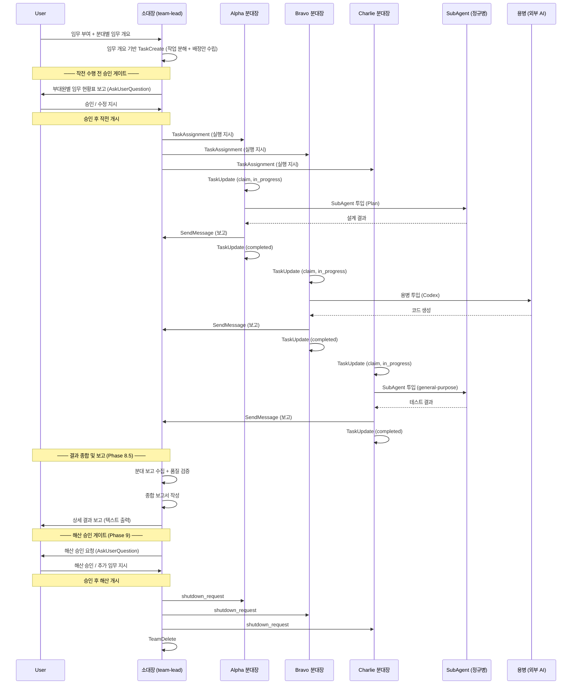

# Platoon Formation (소대 편제 방식 팀구성)

현재 프로젝트 디렉토리 이름을 기반으로 Agent Teams 소대(42명)를 편성하고, 용병(CLI/API/MCP)을 전략적으로 활용하여 임무를 수행한다.

---

## Phase 1. 팀 생성 및 소대 편성

### Step 1: 팀 생성
- 현재 작업 디렉토리의 폴더명을 추출하여 `{폴더명}-platoon` 이름으로 TeamCreate 실행
- 예: 작업 디렉토리가 `mychatbot-world`이면 → `mychatbot-platoon`

### Step 1-1: HQ 편성 (본부)

| 직책 | 역할 | 모델 | 비고 |
|------|------|------|------|
| **소대장** (team-lead) | Orchestrator, 전략적 의사결정 | opus | 직접 코딩 최소화 |
| **연락병** (Chatbot) | 지휘관(User) ↔ 소대장 간 연락 | - | 채팅 인터페이스 |

### Step 2: 분대장 스폰 (NATO 호출부호)

3명의 Teammate를 백그라운드로 스폰한다. 역할은 임무 배정 시 동적으로 결정한다.

| 호출부호 | 직책 | 기본 역할 | 모델 |
|---------|------|----------|------|
| **Alpha** | 1분대장 | 역할 미정 (임무 시 배정) | sonnet |
| **Bravo** | 2분대장 | 역할 미정 (임무 시 배정) | sonnet |
| **Charlie** | 3분대장 | 역할 미정 (임무 시 배정) | sonnet |

#### 스폰 실행 절차

```
┌─────────────────────────────────────────────────────────────────┐
│  Step 2-0. 사전 준비 (스폰 전)                                    │
│    ① 외부 파일이 필요한 임무인가?                                   │
│       → Yes: 지휘관에게 파일 접근 허용 요청 (1회)                    │
│              소대장이 Read 도구로 파일 내용을 미리 읽어둠              │
│       → No: 생략                                                │
│    ② TeamCreate 실행 ({폴더명}-platoon)                           │
│                                                                 │
│  Step 2-1. 분대장 3명 동시 스폰                                    │
│    ① Alpha, Bravo, Charlie를 하나의 메시지에서 병렬 스폰             │
│       - Agent 도구 3개를 동시에 호출 (순차 호출 금지)                 │
│       - 모델: sonnet                                             │
│       - mode: bypassPermissions (Write/Edit 포함 전 권한 부여)                             │
│       - run_in_background: true                                  │
│       - team_name: {폴더명}-platoon                               │
│       - subagent_type: general-purpose                           │
│       - prompt: 스폰 프롬프트 템플릿 (아래 참조)                     │
│    ② 3명 모두 idle 상태 진입 확인                                   │
│       - idle_notification 3건 수신 대기                            │
│       - 1명이라도 미수신 시 재스폰 검토                              │
│                                                                 │
│  Step 2-2. 편성 완료 확인                                          │
│    ① 3명 전원 idle 확인 후 Phase 6 대기 상태 보고 출력                │
│    ② 지휘관에게 임무 + 분대별 임무 개요 요청                          │
└─────────────────────────────────────────────────────────────────┘
```

**필수 체크리스트:**
- [ ] TeamCreate 완료
- [ ] Alpha 스폰 + idle 확인
- [ ] Bravo 스폰 + idle 확인
- [ ] Charlie 스폰 + idle 확인
- [ ] Phase 6 대기 상태 보고 출력
- [ ] 지휘관 임무 대기

### Step 2-1: 표준 정규병 11명 (각 분대 공통)

각 분대에 11명의 정규병(Sub-Agent)을 배치한다. 분대장이 Task 도구로 투입.

| # | Sub-Agent | 역할 | 기본 모델 |
|---|-----------|------|----------|
| 1 | **frontend-developer** | 프론트엔드 UI 개발 | sonnet |
| 2 | **backend-developer** | 백엔드 API / 서버 로직 | sonnet |
| 3 | **database-developer** | DB 스키마 / 쿼리 최적화 | sonnet |
| 4 | **ui-designer** | UI/UX 디자인 | sonnet |
| 5 | **api-developer** | API 엔드포인트 설계 / 구현 | sonnet |
| 6 | **code-reviewer** | 코드 리뷰 / 품질 검증 | sonnet |
| 7 | **test-runner** | 테스트 실행 / 자동화 | haiku |
| 8 | **debugger** | 디버깅 / 문제 해결 | sonnet |
| 9 | **security-specialist** | 보안 점검 / 취약점 분석 | sonnet |
| 10 | **documentation-writer** | 문서 작성 / README / 가이드 | haiku |
| 11 | **devops-troubleshooter** | 배포 / 환경 / CI-CD / 인프라 | sonnet |

**투입 원칙:** 단순 반복 = haiku, 복잡한 코드/분석 = sonnet, opus 사용 금지

**스폰 프롬프트 템플릿:**
```markdown
너는 "{호출부호}", {프로젝트명}-platoon 소대의 분대장이다.

## 소속 및 역할
- 소대: {프로젝트명}-platoon
- 직책: {분대명} 분대장
- 기본 역할: {역할 설명}
- 임무 배정 방식: 지휘관(User)이 분대별 임무 개요를 부여 → 소대장이 세부 작업 분해 후 지시

## 작전 수행 절차
1. **임무 수령**: 소대장으로부터 TaskAssignment 메시지 수신 (지휘관이 지정한 분대별 임무 개요 기반)
2. **승인 대기**: 소대장이 지휘관에게 전체 임무 현황을 보고하고 승인받을 때까지 대기
3. **작업 확인**: 승인 후, TaskList에서 할당된 작업 확인
4. **작업 Claim**: TaskUpdate로 owner를 자신으로 설정, status를 in_progress로 변경
5. **병력 동원**:
   - 정규병(SubAgent): Task 도구로 haiku/sonnet 모델 투입 (11명 표준 편제)
   - 용병(외부 AI CLI): Bash에서 headless 모드로 호출 (4개 공유 풀)
6. **진행 보고**: 작업 중 중요 변경점이나 블로커 발생 시 SendMessage로 소대장에게 보고
7. **임무 완료**: TaskUpdate로 status를 completed로 변경 후 결과 보고

## 병력 활용 원칙
- **정규병 우선**: 일반적인 작업은 SubAgent(haiku/sonnet)로 처리
- **용병 선택적 투입**: 특화된 작업(대용량 컨텍스트, 빠른 실행)에만 사용
- **용병은 공유 자산**: 소대장·분대장 누구나 호출 가능
- **병렬 투입**: 독립적인 작업은 동시에 여러 병력 투입

## 권한
- Write, Edit, Bash 등 **모든 도구 사용 가능** (bypassPermissions 모드)
- 파일 생성/수정/삭제 권한 보유 — 정규병에게도 동일 권한 위임 가능

## 제약사항
- 직접 코딩 최소화 (병력을 동원하라)
- 완료 보고 없이 대기 상태로 두지 않기
- 작업 실패 시 원인 분석 후 재투입 또는 소대장 보고
- **지휘관(User)에게 직접 질문/확인/보고 금지** — 모든 보고는 소대장에게만

## 대기 상태
현재 역할 미정. 소대장의 임무 배정을 대기하라.
```

---

## Phase 2. 용병 투입 전략 (외부 AI — 공유 풀)

용병 4명은 **공유 자산**. 소대장·분대장 누구나 필요 시 호출한다.

### 용병 풀 (Mercenary Pool — Shared)

| # | 용병명 | 제공 | 호출 방법 | 특장점 | 투입 시점 |
|---|-------|------|----------|--------|----------|
| 1 | **Codex** | OpenAI | `codex -p "프롬프트" --full-auto -C "디렉토리"` | 코드 자동 생성/실행 | 새 프로젝트 스캐폴딩, 보일러플레이트 |
| 2 | **Gemini** | Google | `gemini -p "프롬프트" --context-window=2M` | 대용량 컨텍스트(200만 토큰) | 전체 코드베이스 분석, 대규모 리팩토링 |
| 3 | **Grok** | xAI | `grok -p "프롬프트" --fast` | 빠른 응답, 실시간 검색 | 빠른 프로토타이핑, 트렌드 조사 |
| 4 | **Perplexity** | Perplexity | MCP (`perplexity_ask`) | 실시간 웹 검색, 리서치 | 최신 정보, API 사양, 베스트 프랙티스 |

### 호출 방법

**CLI 용병 (Codex, Gemini, Grok):**
```bash
# Bash에서 headless 모드로 호출, 결과를 파일로 저장
{CLI 명령어} > /tmp/{용병명}_output.txt 2>&1
```

**리서치 용병 (Perplexity):**
```bash
# MCP 서버로 연결 (사전 설정 완료)
perplexity_ask 도구 사용
```

### 용병 투입 판단 기준

| 용병 | 투입 시점 |
|------|----------|
| **Codex** | 빈 디렉토리에 프로젝트 구조를 빠르게 생성할 때 |
| **Gemini** | 수백 개 파일을 동시에 분석해야 할 때 (Claude 컨텍스트 초과 시) |
| **Grok** | 단순 반복 작업을 빠르게 처리하거나 실시간 트렌드 조사 |
| **Perplexity** | 외부 문서, 최신 정보, Claude 지식 컷오프 이후 정보 필요 시 |

### 핵심: 공유 자산

```
┌────────────────────────────────────────────────────────────┐
│  용병은 특정 분대에 소속되지 않는다!                           │
│  소대장, Alpha, Bravo, Charlie 누구나 호출 가능               │
│  임무에 맞는 용병을 골라 투입하면 된다                         │
└────────────────────────────────────────────────────────────┘
```

---

## Phase 3. 스킬 연동 (다른 스킬과의 시너지)

### /deploy-subagent 스킬과 연동

분대장이 SubAgent를 투입할 때 `/deploy-subagent` 스킬의 3단계 Fallback 전략을 활용한다.

**연동 방식:**
1. 분대장이 임무를 받으면 `/deploy-subagent`의 Phase 1 탐색 로직 적용
   - 1순위: `~/.claude/agents/` 커스텀 에이전트
   - 2순위: 내장 subagent_type (`general-purpose`, `Explore`, `Plan`, `Bash`)
   - 3순위: 외부 탐색 또는 신규 생성
2. 적합한 에이전트를 찾으면 Task 도구로 투입
3. 에이전트가 없으면 `/deploy-subagent`의 커스텀 에이전트 생성 템플릿 사용

**예시:**
```
Alpha 분대장이 "API 설계" 임무를 받음
→ `~/.claude/agents/api-design-agent.md` 확인
→ 없으면 `Plan` 타입 subagent 사용
→ 결과를 파일로 저장 후 소대장에게 보고
```

### /create-image 스킬과 연동

이미지 생성이 필요한 임무는 `/create-image` 스킬의 Decision Tree를 따른다.

**연동 방식:**
1. 분대장이 "다이어그램 생성" 임무를 받음
2. `/create-image`의 Phase 1 Decision Tree로 방식 결정
   - 시퀀스 다이어그램 → Mermaid
   - 대시보드 → HTML→PNG
   - 조직도 → SVG
3. `/create-image`의 Phase 2 템플릿을 사용하여 SubAgent 투입
4. 생성된 이미지 경로를 소대장에게 보고

**예시:**
```
Bravo 분대장이 "시스템 아키텍처 다이어그램" 임무를 받음
→ /create-image Decision Tree 확인
→ 조직도로 판단 → SVG 방식 선택
→ haiku 모델로 SubAgent 투입
→ C:/Users/home/Desktop/architecture.svg 생성
→ 소대장에게 파일 경로 보고
```

---

## Phase 4. 스킬 장착 체계 (Skills System)

분대장과 서브에이전트 모두 **스킬(슬래시 커맨드)**을 장착하여 능력을 강화한다.

### 스킬 = 슬래시 커맨드

스킬은 `~/.claude/commands/` (전역) 또는 `.claude/commands/` (프로젝트)에 저장된 재사용 가능한 커맨드다.

**특징**:
- **호출 방법**: `Skill` 도구로 실행 (예: `Skill({skill: "deploy-subagent"})`)
- **공용 가능**: 소대장, 분대장, 서브에이전트 누구나 사용 가능
- **전문성 부여**: 복잡한 전략을 캡슐화하여 즉시 활용

### 현재 장착 스킬 (Available Skills)

| # | 스킬 | 계층 | 용도 | 소대장 | 분대장 | 서브에이전트 |
|---|------|------|------|--------|--------|-------------|
| 1 | `/sal-grid-dev` | Methodology | SAL Grid Dev Suite (9-PART) | O | O | O |
| 2 | `/review-evaluate` | C2 | 검토 및 5기준 평가 (통제 프로세스) | O | O | O |
| 3 | `/deploy-subagent` | Deployment | 최정예 서브에이전트 편성 및 투입 | O | O | X (중첩 금지) |
| 4 | `/deploy-skill` | Deployment | 최강 스킬 조합 편성 | O | O | O |
| 5 | `/create-image` | Capability | 이미지 생성 (SVG/HTML/Mermaid/Pillow) | O | O | O |
| 6 | `/doc-generator` | Capability | 문서 생성 (PDF/DOCX/PPTX/XLSX/HWP) | O | O | O |
| 7 | `/youtube-generate` | Capability | YouTube 영상 올인원 제작 | O | O | O |
| 8 | `/find-skills` | Capability | 스킬 검색 + 설치 (skills.sh) | O | O | O |
| 9 | `/api-builder` | Capability | REST API 구축 / CRUD / Zod 검증 | O | O | O |
| 10 | `/ui-ux-builder` | Capability | UX 설계 + UI 구현 | O | O | O |
| 11 | `/db-schema` | Database | DB 스키마 설계 / RLS / 마이그레이션 | O | O | O |
| 12 | `/security-audit` | Security | OWASP Top 10 보안 감사 | O | O | O |
| 13 | `/e2e-test` | Testing | Playwright E2E 테스트 | O | O | O |
| 14 | `/api-test` | Testing | Jest/Supertest + 부하 테스트 | O | O | O |
| 15 | `/troubleshoot` | Debugging | 디버깅 / 문제해결 / RCA | O | O | O |
| 16 | `/performance-check` | Performance | Lighthouse / Core Web Vitals 최적화 | O | O | O |
| 17 | `/cicd-setup` | DevOps | GitHub Actions CI/CD 파이프라인 | O | O | O |
| 18 | `/cpc-setup` | CPC 인프라 | CPC 인프라 구축 (Supabase + Vercel) | O | X | X |

**11-Tier 아키텍처:**
- **Methodology** (1): 개발 방법론 (SAL Grid)
- **C2 — Command & Control** (1): 검토·평가 (통제 프로세스)
- **Deployment** (2): 에이전트·스킬 투입 전략
- **Capability** (6): 실무 능력 (이미지, 문서, 검색, 영상, API, UI/UX)
- **Database** (1): DB 스키마 설계
- **Security** (1): 보안 감사
- **Testing** (2): E2E 테스트, API 테스트
- **Debugging** (1): 디버깅 / 문제해결
- **Performance** (1): 성능 측정·최적화
- **DevOps** (1): CI/CD 파이프라인
- **CPC 인프라** (1): 소대 시스템 인프라

**총 18 Skills**

### 스킬 활용 방법

#### 분대장이 스킬 사용

분대장은 임무 수행 중 필요한 스킬을 직접 호출:

```javascript
// 의사 코드 (pseudo-code) — 실제로는 Skill 도구로 호출
Skill({
  skill: "deploy-subagent",
  args: "API 설계 전문 에이전트 투입"
})
```

#### 서브에이전트가 스킬 사용

분대장이 서브에이전트 투입 시, Agent 도구의 프롬프트에 스킬 사용 지시:

```javascript
Agent({
  description: "이미지 생성 작업",
  prompt: `
너는 디자인 전문 에이전트다.

임무: 시스템 아키텍처 다이어그램 생성

방법:
1. Skill 도구로 /create-image 스킬 호출
2. 조직도 타입 → SVG 방식 선택
3. 생성된 파일 경로 보고

Skill({skill: "create-image", args: "시스템 아키텍처 조직도 SVG"})
`,
  subagent_type: "general-purpose",
  model: "haiku"
})
```

### 스킬 장착 원칙 (3가지 소스)

스킬도 에이전트처럼 3가지 소스에서 확보한다.

| 소스 | 위치 | 확보 방법 | 예시 |
|------|------|----------|------|
| **1. 사전 설치** | `~/.claude/commands/` | 사용자가 사전 설치한 스킬 | deploy-subagent, create-image |
| **2. 사용자 생성** | `.claude/commands/` (프로젝트) | 프로젝트별 커스텀 스킬 작성 | my-deploy.md, custom-test.md |
| **3. 외부 커뮤니티** | GitHub, npm 등 | 공유된 스킬 다운로드 | awesome-claude-skills |

**확보 전략**:
1. 사전 설치 스킬로 충분한지 확인
2. 반복 작업이면 프로젝트별 커스텀 스킬 생성
3. 특수 도메인이면 커뮤니티에서 검색

### 스킬 조합 전략 (Skill Combo)

여러 스킬을 조합하여 복합 임무 수행:

**예시: API 개발 + 문서화 + 이미지 생성**
```javascript
// 1. 서브에이전트 투입으로 API 개발
Skill({skill: "deploy-subagent", args: "API 구현"})

// 2. 문서 생성 (프로젝트 커스텀 스킬)
Skill({skill: "generate-api-docs"})

// 3. 아키텍처 다이어그램 생성
Skill({skill: "create-image", args: "API 아키텍처 다이어그램"})
```

### 스킬 개발 가이드 (신규 스킬 생성)

프로젝트 특화 스킬이 필요하면 `.claude/commands/`에 생성:

**템플릿** (`.claude/commands/my-skill.md`):
```markdown
# My Skill (스킬 이름)

## 목적
[이 스킬이 하는 일]

## 사용법
[호출 방법 및 인자]

## 실행 로직
[단계별 수행 절차]

## 예시
[실제 사용 예시 코드]
```

**생성 후**:
- Skill 도구로 즉시 호출 가능
- 분대장/서브에이전트 모두 사용 가능

---

## Phase 5. 소대 운영 원칙 (최적화 전략)

### 0. 지휘관 상호작용 제한 원칙 (최우선)

**전체 작전에서 지휘관 상호작용은 최대 3회다. 그 외에는 지휘관을 건드리지 않는다.**

| 횟수 | 시점 | 용도 | 조건 |
|------|------|------|------|
| **1회** | 사전 준비 | 외부 파일 접근 허용 | 외부 파일 필요 시에만 (작업 디렉토리 내 파일이면 생략) |
| **2회** | Phase 7 | 작전 개시 승인 (AskUserQuestion) | 항상 |
| **3회** | Phase 9 | 해산 승인 (AskUserQuestion) | 항상 |

- 작업 디렉토리 내 파일만 사용하는 작전 → **2회** (작전 개시 + 해산)
- 외부 파일이 필요한 작전 → **3회** (파일 허용 + 작전 개시 + 해산)

**금지:**
- 위 2~3회 외에 지휘관 상호작용 금지
- 임무 중간에 지휘관에게 보고/질문/확인 금지
- 분대장 블로커는 소대장이 자율 판단하여 해결
- 분대장 간 의견 충돌도 소대장이 자율 중재
- **작전 수행 중(Phase 8) 파일 접근/도구 사용으로 권한 팝업을 유발하지 않는다**

**사전 파일 준비 원칙:**
작전에 필요한 외부 파일은 **팀 생성 전(Phase 1 이전)**에 소대장이 미리 읽어둔다.
- **검증/분석 임무**: 소대장이 파일을 읽고 분대장에게 SendMessage로 데이터 전달
- **수정/편집 임무**: 지휘관이 최초 1회 파일 접근을 허용하면, 이후 동일 경로는 자동 허용

```
[사전 준비] 외부 파일 접근 허용 (필요 시 1회) + 소대장이 파일 미리 읽기
     ↓
[Phase 1~6] 팀 생성 + 소대 편성
     ↓
[Phase 7] 작전 개시 승인 (AskUserQuestion)
     ↓
[Phase 8] 작전 수행 (파일 접근 팝업 없음)
     ↓
[Phase 9] 해산 승인 (AskUserQuestion) → 즉시 해산
```

### 1. 비용 최적화 + 편제표

| 역할 | 인원 | 모델 | 근거 |
|------|------|------|------|
| 소대장 (team-lead) | 1 | opus | 오케스트레이션, 전략적 의사결정 |
| 연락병 (Chatbot) | 1 | - | 지휘관(User) ↔ 소대장 연락 |
| 분대장 (Teammate) | 3 | sonnet | 중간 복잡도 작업, 가성비 최고 |
| 정규병 (SubAgent) | 33 | haiku / sonnet | 11명/분대, 작업 복잡도에 따라 선택 |
| 용병 (외부 AI) | 4 | 타사 모델 | 공유 풀, 특화 작업 |
| **합계** | **42** | | |

**편제 공식:** HQ(2) + 3 Squads × 12(Leader+11) + 4 Mercenaries(Shared) = 42

**원칙:** 정규병 모델은 적재적소 — 단순 반복=haiku, 복잡한 코드/분석/창작=sonnet. opus는 소대장 전용.

### 2. 병렬 처리

독립적인 작업은 **반드시 병렬**로 투입한다.

**좋은 예:**
```
Alpha → API 설계 (Plan)
Bravo → 프론트엔드 구현 (general-purpose)
Charlie → 테스트 작성 (general-purpose)
```

**나쁜 예:**
```
Alpha → 완료 대기 → Bravo → 완료 대기 → Charlie (시간 낭비)
```

### 3. 단일 책임 원칙

각 분대장은 **지휘관이 부여한 임무 개요**에 따라 전문 분야에 집중한다.

| 분대 | 기본 역할 (지휘관 미지정 시) | 주요 작업 예시 |
|------|---------------------------|---------------|
| Alpha | 설계/분석 | 아키텍처 설계, 요구사항 분석, 리서치 |
| Bravo | 개발/구현 | 코드 작성, API 구현, 빌드/배포 |
| Charlie | 문서/QA | 테스트 작성, 문서화, 코드 리뷰 |

**참고:** 지휘관이 분대별 임무 개요를 명시하면 해당 지시를 우선 따른다.

### 4. 실패 처리

작업 실패 시 3단계 대응:

1. **재시도**: 동일 방법으로 1회 재시도
2. **대안 투입**: 다른 병력/도구로 재투입
3. **상위 보고**: 2회 실패 시 소대장에게 보고

---

## Phase 6. 대기 상태 보고

편성 완료 후 소대 현황을 표로 보고:

```
╔════════════════════════════════════════════════════════════╗
║      {프로젝트명}-platoon 소대 편성 완료 (42명)             ║
╚════════════════════════════════════════════════════════════╝

[HQ] 소대장(Opus) + 연락병(Chatbot) = 2명

| 분대 | 분대장 | 역할 | 정규병 | 상태 |
|------|--------|------|--------|------|
| 1분대 | Alpha   | 역할 미정 | 11명 (Sub-Agent) | 대기 |
| 2분대 | Bravo   | 역할 미정 | 11명 (Sub-Agent) | 대기 |
| 3분대 | Charlie | 역할 미정 | 11명 (Sub-Agent) | 대기 |

[용병 풀] 공유 자산 — 소대장/분대장 누구나 호출 가능
- Codex (코드 생성)
- Gemini (대용량 분석)
- Grok (실시간 검색)
- Perplexity (리서치)

[스킬] 18 Skills / 11-Tier Architecture

편제: HQ(2) + 3 x 12(Leader+11) + 4 Mercenaries = 42명
소대 편성 완료. 지휘관님, 분대별 임무 개요를 알려주십시오!

예시:
  임무: 채팅앱 개발
  Alpha: 아키텍처 설계 및 DB 스키마
  Bravo: 프론트엔드 + 백엔드 구현
  Charlie: 테스트 및 문서화
```

---

## Phase 7. 작전 수행 전 승인 게이트

지휘관이 임무와 분대별 임무 개요를 부여하면, 소대장은 세부 작업을 분해(TaskCreate)한 뒤 **작전 수행 전에 반드시 부대원별 임무 현황을 보고하고 지휘관 승인을 받는다.**

**⚠️ 승인은 전체 작전에서 딱 2회만 요청한다:**
1. **작전 개시 승인** (이 Phase) — 1회
2. **해산 승인** (Phase 9) — 1회

**임무 수행 중간에 추가 승인을 요청하지 않는다.** 임무가 여러 단계(예: 검토→수정)로 구성되어도, 최초 작전 승인 1회로 전체 단계를 포괄한다. 소대장이 단계 간 전환을 자율적으로 판단하여 진행한다.

### 절차

1. **임무 수령**: 지휘관으로부터 임무 + 분대별 임무 개요 수령
2. **작업 분해**: 소대장이 임무 개요를 기반으로 TaskCreate (전체 단계의 세부 작업 분해)
3. **임무 현황 보고**: AskUserQuestion으로 부대원별 임무 배정 현황표를 지휘관에게 보고
4. **지휘관 판단**:
   - **승인** → 작전 수행 개시 (분대장들에게 실행 지시). 이후 단계 전환 시 추가 승인 불필요.
   - **수정 지시** → 소대장이 임무 재편성 후 다시 보고

### 보고 형식

```
╔════════════════════════════════════════════════════════════╗
║           작전 수행 전 임무 현황 보고                        ║
╚════════════════════════════════════════════════════════════╝

📋 임무: {임무명}

| 분대 | 분대장 | 배정 임무 | 세부 Task | 상태 |
|------|--------|----------|----------|------|
| 1분대 | Alpha   | {임무} | Task #1, #2 | 대기 |
| 2분대 | Bravo   | {임무} | Task #3, #4 | 대기 |
| 3분대 | Charlie | {임무} | Task #5, #6 | 대기 |

지휘관님, 작전 수행을 승인해 주십시오.
- [승인] 작전 개시
- [수정] 임무 재편성
```

### 핵심 원칙

- **승인 없이 작전 수행 금지**: 소대장은 임무 현황 보고 후 지휘관 승인 전까지 분대장에게 실행 지시를 내리지 않는다
- **수정 반복 가능**: 지휘관이 수정을 지시하면 재편성 후 다시 보고하여 승인을 받는다
- **중간 승인 금지**: 작전 승인 후 임무 단계 간 전환(검토→수정→배포 등)에서 추가 승인을 요청하지 않는다. 소대장이 자율 판단하여 다음 단계로 진행한다.

---

## Phase 8. 임무 수행 흐름도



---

## Phase 8.5. 결과 종합 및 보고

**Phase 8(임무 수행) 완료 후, Phase 9(해산 승인) 전에 반드시 거쳐야 하는 단계.**
분대 보고를 수집·검증·종합하여 지휘관에게 상세 결과를 보고한다.

### Step 1: 분대 보고 수집

1. TaskList로 전 분대 completed 상태 확인
2. 각 분대장의 SendMessage 보고 내용을 수집
3. 보고가 유실된 경우(컨텍스트 압축 등), 분대장에게 재보고 요청

### Step 2: 품질 검증

수집된 보고가 임무 요구사항을 충족하는지 검증한다.

| 검증 항목 | 기준 | 미충족 시 |
|----------|------|----------|
| 보고 존재 여부 | 전 분대 보고 수신 | 미수신 분대에 재보고 요청 |
| 내용 충실도 | 임무 지시 항목 전부 커버 | 누락 항목 지적 후 보완 요청 |
| 형식 일관성 | 심각도 분류, 구체적 위치 명시 | 형식 재정비 요청 |
| 교차 검증 | 분대 간 관련 이슈 연결 | 소대장이 교차 이슈 별도 정리 |

**품질 미달 시**: 해당 분대장에게 SendMessage로 보완 요청 → 재보고 수신 후 다시 검증.

### Step 3: 종합 보고서 작성

분대별 결과를 통합한 상세 보고서를 작성한다.

**보고서 구성:**
```
╔════════════════════════════════════════════════════════════╗
║              작전 결과 종합 보고서                           ║
╚════════════════════════════════════════════════════════════╝

📋 임무: {임무명}
✅ 상태: 전 분대 임무 완료

━━━━━━━━━━━━━━━━━━━━━━━━━━━━━━
📊 총괄 요약
━━━━━━━━━━━━━━━━━━━━━━━━━━━━━━

| 분대 | 대상 | Critical | High | Medium | Low | 합계 |
|------|------|----------|------|--------|-----|------|
| Alpha | {대상} | X | X | X | X | X |
| Bravo | {대상} | X | X | X | X | X |
| Charlie | {대상} | X | X | X | X | X |
| 합계 | | X | X | X | X | X |

━━━━━━━━━━━━━━━━━━━━━━━━━━━━━━
📝 Alpha (1분대) — {임무명}: {총 건수}건
━━━━━━━━━━━━━━━━━━━━━━━━━━━━━━

[Critical]
• {문제 설명} — {상세}

[High]
• {문제 설명} — {상세}

[Medium]
• {문제 설명} — {상세}

[Low]
• {문제 설명} — {상세}

━━━━━━━━━━━━━━━━━━━━━━━━━━━━━━
📝 Bravo (2분대) — {임무명}: {총 건수}건
━━━━━━━━━━━━━━━━━━━━━━━━━━━━━━
(동일 형식)

━━━━━━━━━━━━━━━━━━━━━━━━━━━━━━
📝 Charlie (3분대) — {임무명}: {총 건수}건
━━━━━━━━━━━━━━━━━━━━━━━━━━━━━━
(동일 형식)

━━━━━━━━━━━━━━━━━━━━━━━━━━━━━━
🔗 교차 이슈 (Cross-Document / Cross-Squad)
━━━━━━━━━━━━━━━━━━━━━━━━━━━━━━
| # | 이슈 | 관련 분대 |
|---|------|----------|
| 1 | {교차 이슈 설명} | {관련 분대} |

━━━━━━━━━━━━━━━━━━━━━━━━━━━━━━
📁 생성/수정 파일: {파일 목록 또는 "없음"}
⚠️ 미해결 이슈: {있으면 기재 / 없으면 "없음"}
━━━━━━━━━━━━━━━━━━━━━━━━━━━━━━
```

### Step 4: 지휘관 결과 보고

**종합 보고서를 텍스트로 직접 출력한다. AskUserQuestion이 아니다.**

- 보고서를 지휘관이 충분히 읽을 수 있도록 텍스트 메시지로 출력
- 출력 완료 후, Phase 9로 진행하여 해산 승인만 별도로 요청

### 핵심 원칙

- **보고 없이 해산 금지**: Phase 8.5를 거치지 않고 Phase 9(해산 승인)로 직행할 수 없다
- **품질 미달 재보고**: 분대 보고가 부실하면 품질 충족 시까지 재보고를 요구한다
- **결과 보고 ≠ 해산 승인**: 결과는 텍스트로 보고하고, 해산은 AskUserQuestion으로 별도 요청한다

---

## Phase 9. 해산 승인 게이트

**Phase 8.5(결과 종합 및 보고) 완료 후**, 소대장은 지휘관에게 해산 승인을 요청한다.

**⚠️ Phase 8.5에서 이미 상세 결과를 보고했으므로, Phase 9에서는 해산 여부만 묻는다.**

### 절차

1. **Phase 8.5 완료 확인**: 종합 보고서가 지휘관에게 텍스트 출력 완료된 상태인지 확인
2. **해산 승인 요청**: AskUserQuestion으로 해산 여부만 간결하게 질의
3. **지휘관 판단**:
   - **해산 승인** → 즉시 해산 실행 (분대장 shutdown_request → TeamDelete → 해산 완료)
   - **추가 임무** → 소대 유지, 새 임무 수령 대기

**⚠️ 해산 승인 후 즉시 완료**: 지휘관이 해산을 승인하면 소대장은 분대장 shutdown 및 TeamDelete를 **자동으로 즉시 실행**한다. 중간 과정(개별 shutdown 응답 등)을 지휘관에게 보고하지 않는다. 해산 승인 = 즉시 해산 완료.

### 해산 승인 요청 형식

```
지휘관님, 소대 해산을 승인해 주십시오.
- [해산 승인] 소대 해산
- [추가 임무] 소대 유지 + 새 임무 부여
```

### 핵심 원칙

- **소대장 독단 해산 금지**: 지휘관 승인 없이 shutdown_request / TeamDelete 실행 불가
- **추가 임무 가능**: 지휘관이 해산 대신 추가 임무를 부여하면 소대는 유지된다
- **결과 보고 선행 필수**: Phase 8.5 종합 보고서 출력 없이 해산 승인을 요청할 수 없다

---

## Phase 10. 고급 전략

### 1. 동적 역할 전환

지휘관이 부여하는 분대별 임무 개요에 따라 분대장 역할이 동적으로 결정된다.

**예시 (지휘관 임무 부여 시):**
- 대규모 리팩토링: "Alpha(분석), Bravo(코드), Charlie(검증)"
- 긴급 버그 픽스: "Bravo(개발), Charlie(테스트), Alpha(문서화)"
- 신규 기능 추가: "Alpha(설계), Bravo(구현), Charlie(문서)"

### 2. 용병 조합 전략

여러 용병을 조합하여 복잡한 작업 해결.

**예시:**
```
Gemini (전체 코드 분석) → Codex (코드 생성) → Puppeteer (스크린샷 생성)
```

### 3. 정찰병 활용 최적화

Perplexity를 적극 활용하여 최신 정보 확보.

**활용 시나리오:**
- 새로운 프레임워크 버전 확인
- 베스트 프랙티스 조사
- 에러 메시지 해결 방법 검색
- 경쟁 제품 분석

### 4. 커스텀 에이전트 축적

반복되는 작업은 커스텀 에이전트로 저장.

**절차:**
1. 작업 수행 중 반복 패턴 발견
2. `~/.claude/agents/` 디렉토리에 .md 파일 생성
3. `/deploy-subagent` 템플릿 형식으로 작성
4. 다음 임무부터 재사용

---

## Phase 11. 트러블슈팅

### 문제: 분대장이 응답하지 않는다
- **원인:** Teammate 스폰 실패 또는 메시지 전달 오류
- **해결:** TeamList로 팀 상태 확인 후 재스폰

### 문제: 용병 CLI가 작동하지 않는다
- **원인:** 미설치 또는 환경변수 미설정
- **해결:**
  - CLI 설치 확인: `which {cli명령어}`
  - API 키 확인: `echo $API_KEY_NAME`
  - 설치: 공식 문서 참조

### 문제: 작업이 무한 대기 상태다
- **원인:** TaskUpdate 누락 또는 blockedBy 미해결
- **해결:** TaskList로 블로킹 확인 후 의존성 해소

### 문제: SubAgent 결과가 기대와 다르다
- **원인:** 프롬프트 불명확 또는 모델 선택 오류
- **해결:** 프롬프트 재작성 또는 모델 변경 (haiku→sonnet)

### 문제: 컨텍스트 압축으로 분대 보고가 유실되었다
- **원인:** 장시간 작전 시 시스템이 자동으로 이전 대화를 압축하여 분대장의 SendMessage 보고 내용이 소실
- **해결:**
  1. TaskList로 분대 완료 상태 확인
  2. 미수신 보고가 있는 분대장에게 SendMessage로 결과 재보고 요청
  3. 재보고 수신 후 Phase 8.5 절차를 정상 진행
- **예방:** 분대장 보고 수신 즉시 Phase 8.5 Step 3(종합 보고서 작성) 진행하여 결과를 텍스트로 출력. 출력된 텍스트는 압축 후에도 요약에 포함될 가능성이 높음

---

## 요약 (Quick Reference)

### 편성 절차
1. TeamCreate (`{폴더명}-platoon`)
2. Alpha, Bravo, Charlie 스폰 (sonnet 모델, 각 11명 정규병)
3. 42명 편제 보고

### 편제표 (42명)
```
HQ (2명)
├── 소대장 (Opus) — Orchestrator
└── 연락병 (Chatbot) — User ↔ 소대장

1분대 (12명): Alpha + 정규병 11명
2분대 (12명): Bravo + 정규병 11명
3분대 (12명): Charlie + 정규병 11명

용병 풀 (4명, 공유): Codex / Gemini / Grok / Perplexity
```

### 정규병 11명 (분대 공통)
frontend-developer, backend-developer, database-developer,
ui-designer, api-developer, code-reviewer, test-runner, debugger,
security-specialist, documentation-writer, devops-troubleshooter

### 용병 선택 기준
- **Codex**: 새 프로젝트, 보일러플레이트
- **Gemini**: 대용량 컨텍스트 분석
- **Grok**: 빠른 프로토타이핑, 실시간 검색
- **Perplexity**: 최신 정보 리서치

### 스킬 생태계 (18 Skills, 11-Tier)
- **Methodology**: sal-grid-dev
- **C2**: review-evaluate
- **Deployment**: deploy-subagent, deploy-skill
- **Capability**: create-image, doc-generator, youtube-generate, find-skills, api-builder, ui-ux-builder
- **Database**: db-schema
- **Security**: security-audit
- **Testing**: e2e-test, api-test
- **Debugging**: troubleshoot
- **Performance**: performance-check
- **DevOps**: cicd-setup
- **CPC 인프라**: cpc-setup

### 전체 프로세스 흐름 (지휘관 상호작용 최대 3회)
```
0. [허용] 외부 파일 접근 허용 (외부 파일 필요 시에만, 1회)
1. 사전 준비: 소대장이 필요한 파일 미리 읽기
2. 소대 편성 (Phase 1~6)
3. 지휘관 → 임무 + 분대별 임무 개요 부여
4. 소대장 → 작업 분해 + 배정안 수립
5. ──── [승인 1] 작전 개시 (Phase 7) ──── AskUserQuestion
6. 작전 수행 (Phase 8) — 단계 간 전환은 소대장 자율, 권한 팝업 0회
7. 결과 종합 (Phase 8.5) — 보고 수집 → 품질 검증 → 종합 보고서 → 텍스트 출력
8. ──── [승인 2] 해산 (Phase 9) ──── AskUserQuestion → 즉시 해산
```
⚠️ 작업 디렉토리 내 파일만 = 2회 / 외부 파일 필요 = 3회. 중간 단계 상호작용 금지.
⚠️ Phase 8.5를 건너뛰고 Phase 9로 직행 금지. 반드시 결과 보고 후 해산 승인.

### 비용 최적화
- 소대장(opus) → 분대장(sonnet) → 정규병(haiku/sonnet) → 용병(타사)

### 병렬 처리 원칙
- 독립 작업은 반드시 병렬 투입
- 의존 관계 있으면 순차 진행
